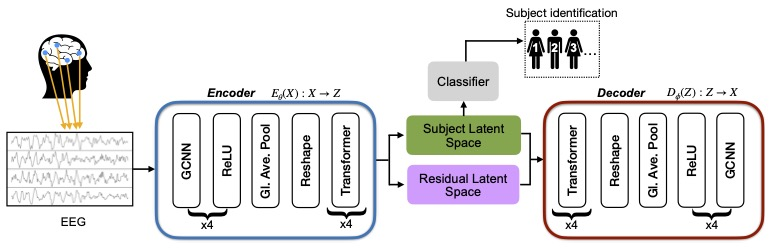

# GC-VASE: Graph Convolutional Variational Autoencoder for Subject Representation Learning from EEG
> Subject Representation Learning from EEG using Graph Convolutional Variational Autoencoders [IEEE-ICASSP 2025]

## Introduction
> We propose GC-VASE, a graph convolutional-based variational autoencoder that leverages contrastive learning for subject representation learning from EEG data. Our method successfully learns robust subject-specific latent representations using the split-latent space architecture tailored for subject identification. To enhance the model's adaptability to unseen subjects without extensive retraining, we introduce an attention-based adapter network for fine-tuning, which reduces the computational cost of adapting the model to new subjects. Experiments demonstrate that our method significantly outperforms other deep learning approaches, achieving state-of-the-art results with a subject balanced accuracy of 89.81% and 70.85% on the ERP-Core and SleepEDFx-20 datasets, respectively. After subject adaptive fine-tuning, GC-VASE further improves the subject balanced accuracy to 90.31% on ERP-Core. Additionally, we perform a detailed ablation study to highlight the impact of the key components of our method.

## Diagram


## Requirements
```bash
pip install -r requirements.txt
```

## Data Pre-processing
The first step is data preparation. Begin by downloading the dataset, ensuring the folder structure remains unaltered. The dataset can be obtained from the [ERP-CORE repository](https://osf.io/thsqg/). Within the `data_preparation` directory, the `create_dataset.py` script processes the data to generate a Pickle file containing all examples, along with their corresponding subject and task labels. You can execute the script using the following command:

```bash
python create_dataset.py
```

Use the `sleepedfx.py` in the `SleepEDFx` folder for pre-processing the [SleepEDFx](https://www.physionet.org/content/sleep-edfx/1.0.0/) database. It can be implemented by the following command:

```bash
python sleepedfx.py
```


