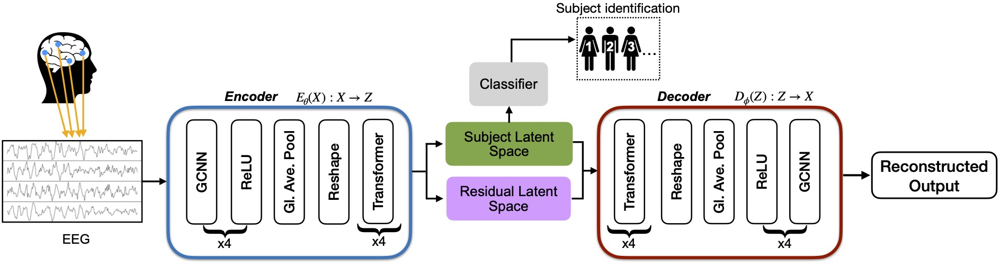

# GC-VASE: Graph Convolutional Variational Autoencoder for Subject Representation Learning from EEG
> Subject Representation Learning from EEG using Graph Convolutional Variational Autoencoders

## Introduction
> We propose GC-VASE, a graph convolutional-based variational autoencoder that leverages contrastive learning for subject representation learning from EEG data. Our method successfully learns robust subject-specific latent representations using the split-latent space architecture tailored for subject identification. To enhance the model's adaptability to unseen subjects without extensive retraining, we introduce an attention-based adapter network for fine-tuning, which reduces the computational cost of adapting the model to new subjects. Experiments demonstrate that our method significantly outperforms other deep learning approaches, achieving state-of-the-art results with a subject balanced accuracy of 89.81% and 70.85% on the ERP-Core and SleepEDFx-20 datasets, respectively. After subject adaptive fine-tuning, GC-VASE further improves the subject balanced accuracy to 90.31% on ERP-Core. Additionally, we perform a detailed ablation study to highlight the impact of the key components of our method.

## Diagram

